# 🧠 Local AI Lab — CPU-Only Stack (2026)

A modular, privacy-first AI stack that runs entirely on a CPU laptop.
No GPU required. No cloud APIs. No data leaving your machine.

---

## Architecture



---

## Project Folder Structure

```

D:\hotlanta_git\
├── ai-stack\                           # Your Docker Compose stack (this repo)
│   ├── docker-compose.yml              # CORE: Ollama, Open WebUI, Qdrant, SearXNG, Docling, Portainer
│   ├── compose\
│   │   ├── agents.yml                  # AGENTS: AIO Sandbox, Aider
│   │   ├── automation.yml              # AUTOMATION: n8n, Langfuse, Flowise
│   │   ├── guardrails.yml              # GUARDRAILS: NeMo Guardrails
│   │   └── ui-extras.yml               # UI EXTRAS: LobeChat, AnythingLLM
│   ├── build\
│   │   └── nemo-guardrails\
│   │       ├── Dockerfile                # builds NeMo from source
│   │       └── server.py                 # FastAPI wrapper with OpenAI-compatible API
│   ├── config\                         # All service config files (mounted read-only)
│   │   ├── searxng\
│   │   │   └── settings.yml            # SearXNG engine + format config
│   │   └── nemo-guardrails\
│   │       ├── config.yml                # NeMo model + rail settings
│   │       └── rails.co                  # Colang rail definitions
│   └── data\                           # Auto-created by Docker (persistent volumes)
│       ├── ollama\
│       ├── open-webui\
│       ├── qdrant\
│       ├── searxng\
│       ├── docling-cache\
│       ├── n8n\
│       ├── langfuse-db\
│       ├── flowise\
│       ├── lobechat-db\
│       ├── portainer-data\
│       └── aio-workspace\             # Shared: AIO Sandbox + Aider filesystem + Vale-MCP + TruLens + QWED
│
└── hotlanta_git\
    └── deer-flow\                      # DeerFlow repo (cloned separately, runs standalone)
        ├── config.yaml                 # DeerFlow LLM + sandbox + tools config
        ├── .env                        # DeerFlow environment variables
        ├── docker-compose.yml          # DeerFlow's own compose (run separately)
        │   ├── skills\
        │   │   └── visualise\                 # Visualise skill (git cloned)
        ├── backend\
        │   └── src\
        │       └── community\
        │           └── searxng\        # ← YOUR CUSTOM SEARXNG WRAPPER
        │               ├── __init__.py
        │               └── tools.py
        └── Vale-MCP\                    # Vale-MCP repo — mounted into AIO Sandbox
```

---

## Service Map

### Core (always running)
| Service | Purpose | URL |
|---------|---------|-----|
| Ollama | LLM + embedding runtime | http://localhost:11434 |
| Open WebUI | Primary chat UI + RAG | http://localhost:3000 |
| Qdrant | Vector database | http://localhost:6333/dashboard |
| SearXNG | Private web search | http://localhost:8080 |
| Docling | Document extraction engine | http://localhost:5001 |
| Portainer | Docker management UI | https://localhost:9443 |

### Agents (optional)
| Service | Purpose | Notes |
|---------|---------|-------|
| AIO Sandbox | Browser+VNC, VSCode, Shell, Jupyter, MCP Hub | http://localhost:8090 |
| Aider | AI coding agent (CLI) | `docker exec -it aider bash` |
| DeerFlow | Multi-agent research — runs standalone | http://localhost:2026 |

### Automation (optional)
| Service | Purpose | URL |
|---------|---------|-----|
| n8n | Workflow automation | http://localhost:5678 |
| Langfuse | LLM tracing + evals | http://localhost:3020 |
| Flowise | Visual agent builder | http://localhost:3030 |

### Guardrails (optional)
| Service | Purpose | URL |
|---------|---------|-----|
| NeMo Guardrails | Input/output rails + RAG fact-checking | http://localhost:8010 |
| TruLens | RAG triad evaluation (runs in AIO Sandbox) | Jupyter at http://localhost:8090 |
| QWED | Deterministic math/SQL/code verification (runs in AIO Sandbox) | — |

### UI Extras (optional, pick one)
| Service | Purpose | URL |
|---------|---------|-----|
| LobeChat | Multi-model UI + MCP plugins | http://localhost:3100 |
| AnythingLLM | Document RAG workspaces | http://localhost:3001 |

---

## How Guardrails Work Together

```
User query
  │
  ▼
NeMo Guardrails ── Input rail: block off-topic / jailbreak / PII queries
  │
  ▼
Ollama LLM + Qdrant RAG
  │
  ▼
NeMo Guardrails ── Output rail: self-check facts against retrieved context
  │                              refuse if response not grounded
  ▼
TruLens ────────── Score: Context Relevance + Groundedness + Answer Relevance
  │                Log scores to Langfuse for trend tracking
  ▼
QWED ───────────── For math/SQL/code outputs: deterministic proof of correctness
  │                Block if output cannot be verified
  ▼
User response
```

---

## Sequence order

| Phase | Action | Details | Where |
|---|---|---|---|
| Phase 1 | Core stack up and healthy | [Start core stack](#2-start-core-stack) | [Service Map](#service-map) |
| During Phase 1 | Portainer setup must be done within 5 minutes of first start | [Portainer setup](#portainer) | http://localhost:9443 |
| Phase 2 | Pull Ollama models (while core is running | [Pull models](#3-pull-recommended-ollama-models) |  |
| Phase 3 | Configure Open WebUI RAG (one-time, core must be running | [WebUI RAG](#4-configure-rag-chunking-in-open-webui) | http://localhost:3000 |
| Phase 4 | Start agents stack | [Start agents stack](#5-add-optional-layers) |
| During Phase 4 | Vale-MCP setup where agents must be running | [Vale-MCP setup](#vale-mcp-setup-in-aio-sandbox) | Install inside AIO Sandbox terminal (http://localhost:8090) |
| Phase 5 | Start automation stack | [Start Automation stack](#5-add-optional-layers) |
| Phase 6 | Start guardrails stack - *Note:* First run builds NeMo from source — allow ~10 minutes. Verify! |  [Start guardrails stack](#5-add-optional-layers) | Mounted Config files |
| Phase 7 | TruLens setup (agents must be running) | [TruLens setup](#trulens-setup-in-aio-sandbox) | Setup inside AIO Sandbox terminal (http://localhost:8090) |
| Phase 8 | QWED setup (agents must be running) |  [QWED setup](#qwed-verification-setup-in-aio-sandbox) | Setup inside AIO Sandbox terminal (http://localhost:8090) |
| Phase 9 | DeerFlow (everything above should be running first) | [DeerFlow Setup](#deerflow-setup) |
| Phase 10 | UI Extras (optional, pick one - LobeChat or AnythingLLM, any time after core) | [UI extras](#ui-extras) |

---

## Quick Start

### 1. Pull required Docker images (first time only)

#### Core images
```
docker pull ollama/ollama:latest
```

> **Start Ollama first**
```
docker compose up -d ollama
```
```
docker pull qdrant/qdrant:latest
docker pull ghcr.io/open-webui/open-webui:main
docker pull searxng/searxng:latest
docker pull ghcr.io/docling-project/docling-serve:latest
docker pull portainer/portainer-ce:latest
```

#### Automation images
```
docker pull n8nio/n8n:latest
docker pull ghcr.io/langfuse/langfuse:latest
docker pull flowiseai/flowise:latest
docker pull postgres:16-alpine
```

#### Agent images
```
docker pull ghcr.io/agent-infra/sandbox:latest
docker pull paulgauthier/aider:latest
```

#### UI extras 
**(choose one)**
```
docker pull lobehub/lobe-chat-database:latest
docker pull mintplexlabs/anythingllm:latest
```

---

> **Note:** Do NOT pull `ghcr.io/bytedance/deerflow:latest` — no public image exists. DeerFlow must be built from source. See the DeerFlow Setup section below. NeMo Guardrails also has no pre-built image — it builds from source automatically on first `docker compose up` (~10 minutes, cached after that).

---

### 2. Start core stack

Before starting the core stack the first time, review [Security Checklist](#security-checklist).

```
cd D:\hotlanta_git\ai-stack
docker compose up -d
```

> **Note:** 
> * Portainer setup must be done within 5 minutes of first start. See [Portainer setup](#portainer)
> * Docling will download its ML models (~500MB) on first startup.
> This only happens once — subsequent starts are fast.
> Allow 2–5 minutes on first run before uploading documents.

---

### 3. Pull recommended Ollama models 
**(first time only)**

**Start Ollama first**
```
docker compose up -d ollama
```

**Embeddings — bge-m3 (best for technical docs, ~568MB, MIT license) 8192-token context window, sparse+dense retrieval**
```
docker exec ollama ollama pull bge-m3
```

**General chat (fast, ~2.3-3GB) — good for 8GB RAM laptops**
```
docker exec ollama ollama pull qwen3:1.7b-q4_K_M   # or qwen3:4b-q4_K_M for better quality
```

**Best general chat for 16GB RAM laptops (~4.5-5GB)**
```
docker exec ollama ollama pull qwen3:4b-q4_K_M
```

**Best coding model for CPU (~4.5-5GB)**
```
docker exec ollama ollama pull qwen2.5-coder:7b-instruct-q4_K_M
```

**Fast small general + reasoning / guardrail judge model) (~2-3GB)**
```
docker exec ollama ollama pull phi4-mini:3.8b-q4_K_M
```
**or swap to GLM-4.7-Flash / Llama 3.3 8B equivalents**

**Optional: vision / multimodal (~4–6 GB)**
```
docker exec ollama ollama pull llava:7b   # or bakllava / qwen3:5:vision variant if available
```
---

### 4. Configure RAG chunking in Open WebUI 
**(one-time setup)**
After core is running, go to **http://localhost:3000**:
1. Admin Panel → Settings → Documents
2. Set **Content Extraction Engine** → `Docling` → URL: `http://docling:5001`
3. Set **Text Splitter** → `Token`
4. Set **Chunk Size** → `800`
5. Set **Chunk Overlap** → `100`
6. Set **Chunk Min Size Target** → `300`
7. Enable **Markdown Header Text Splitter** → `ON`
8. Set **Top K** → `8`
9. Save

These settings are pre-configured via environment variables as defaults, but confirming them in the UI ensures they're applied correctly.

BGE-M3 supports an 8192-token context window. Larger chunks preserve more context per passage and improve retrieval coherence on long technical documents.

---

### 5. Add optional layers

**Agents**
```powershell
docker compose -f docker-compose.yml -f compose/agents.yml up -d
```

**Automation**
```powershell
docker compose -f docker-compose.yml -f compose/automation.yml up -d
```

**Guardrails**
```powershell
docker compose -f docker-compose.yml -f compose/guardrails.yml up -d
```

**First run builds NeMo Guardrails from source (~10 minutes). Verify it started:**
```powershell
curl http://localhost:8010/health
```

**UI extra -- pick one**

**LobeChat (recommended if you want MCP + multi-model)**
```
docker compose -f docker-compose.yml -f compose/ui-extras.yml up -d lobechat lobechat-db
```

**AnythingLLM (recommended if you do heavy document RAG)**,
```
docker compose -f docker-compose.yml -f compose/ui-extras.yml up -d anythingllm
```

---

### 6. Full stack (everything)
```powershell
docker compose \
  -f docker-compose.yml \
  -f compose/agents.yml \
  -f compose/automation.yml \
  -f compose/guardrails.yml `
  -f compose/ui-extras.yml \
  up -d
```

---

## DeerFlow Setup 
**(standalone — first time only)**
DeerFlow has no pre-built public Docker image and runs as its own separate stack.
1. Clone the repo (skip if already at D:\hotlanta_git\deer-flow)
```
cd D:\hotlanta_git
git clone https://github.com/bytedance/deer-flow.git
```

2. Create config files from examples
```
cd deer-flow
copy .env.example .env
copy config.example.yaml config.yaml
```

3. Add the custom SearXNG wrapper (copy from this repo)
mkdir backend\src\community\searxng
> **Copy __init__.py and tools.py into that folder**

4. Edit config.yaml — configure Ollama, AIO Sandbox, SearXNG tools
> **Edit .env — set SEARXNG_URL and CORS_ORIGINS (see deerflow-config folder)**

5. Set DEER_FLOW_ROOT — required by gateway and langgraph
**To make it permanent (so you don't have to set it every time)**
```
[System.Environment]::SetEnvironmentVariable("DEER_FLOW_ROOT", "D:\hotlanta_git\deer-flow", "User")
```

6. Create extensions_config.json from the example
```
cd D:\hotlanta_git\deer-flow
copy extensions_config.example.json extensions_config.json
```
7. Create frontend/.env if doesn't already exist
8. Check if frontend has an example env file
```
dir frontend
```
If there's a frontend/.env.example, copy it:
```
copy frontend\.env.example frontend\.env
```
If there isn't one, create a minimal blank file:
```
New-Item frontend\.env -ItemType File
```
9. Create the logs/ directory (gateway and langgraph write logs there)
```
mkdir D:\hotlanta_git\deer-flow\logs
```
10.  Use the correct nginx config for your setup
The compose file defaults to nginx.conf but the comment says local/AIO mode (which is yours — no Kubernetes) should use nginx.local.conf. Set this in your .env:
**Open .env and add this line**
```
NGINX_CONF=nginx.local.conf
```

11.  Build and start (~10 minutes first time)
```
docker compose build
docker compose up -d
```

#### Access DeerFlow at http://localhost:2026

To stop: 
```
cd D:\hotlanta_git\deer-flow && docker compose down
```
To update: 
```
git pull  && docker compose build && docker compose up -d
```

---
> **Adding Skills to DeerFlow**
Skills are Markdown-based capability modules that DeerFlow agents load on demand.
They keep the context window lean — only the skill description loads at startup,
full instructions load only when the task needs them.

> **Clone any skill repo into deer-flow/skills/**
```
git clone https://github.com/author/skill-name.git skills/skill-name
```

> **Rebuild**
```
cd D:\hotlanta_git\deer-flow
docker compose build && docker compose up -d
```

The visualise skill lets agents generate interactive SVG diagrams, HTML charts, flowcharts, and explainers inline — triggered by phrases like "show me a diagram of..." or "visualise the architecture of...".

To update a skill after pulling changes:
```
cd D:\hotlanta_git\deer-flow\skills\visualise && git pull
cd D:\hotlanta_git\deer-flow && docker compose build && docker compose up -d
```

---

## Vale-MCP Setup in AIO Sandbox 
**(one-time)**
* Vale-MCP source is mounted from D:\hotlanta_git\Vale-MCP\ (read-only).
* Vale linter config and styles are mounted from `D:\hotlanta_git\vale_linter\` (read-only).

After starting the agents stack, open a terminal inside the aio sandbox container:
```powershell
docker exec -it aio-sandbox bash
```

### 1. Install Vale CLI (Linux binary)
Vale downloads with a version number in the filename — check `/home/gem/` first:
```bash
ls /home/gem/vale*.tar.gz
```
Then extract using the actual filename (replace version number as needed):
```bash
tar -xzf vale_3.14.1_Linux_64-bit.tar.gz
mkdir -p /home/gem/bin
mv vale /home/gem/bin/
echo 'export PATH=$PATH:/home/gem/bin' >> /home/gem/.bashrc
source /home/gem/.bashrc
vale --version
```

### 2. Copy source from read-only mount to writable workspace
```
cp -r /home/gem/vale-mcp-src /home/gem/vale-mcp
```

### 3. Rebuild node_modules for Linux (Windows binaries won't run in the container)
```
cd /home/gem/vale-mcp && npm install && npm run build
```

### 4. Copy Vale config and fix the StylesPath
Copy your existing `.vale.ini` then update the hardcoded Windows path to the Linux path:
```bash
cp /home/gem/vale-linter-src/.vale.ini /home/gem/.vale.ini
sed -i 's|StylesPath = .*|StylesPath = /home/gem/.vale/styles|' /home/gem/.vale.ini
cat /home/gem/.vale.ini
```

### 5. Copy your existing Vale styles (one-time)
```
mkdir -p /home/gem/.vale/styles
cp -r /home/gem/vale-linter-src/styles/. /home/gem/.vale/styles/
```

### 6. Verify
```
vale --version
echo "This is a very unique sentence you should utilize." | vale --ext=.md
```

Vale persists in aio-workspace — no reinstall needed after container restarts.
**To update Vale-MCP after a git pull on Windows:**
```
cp -r /home/gem/vale-mcp-src/. /home/gem/vale-mcp/ && cd /home/gem/vale-mcp && npm install && npm run build
```


---

## TruLens Setup in AIO Sandbox 
**(one-time)**

TruLens evaluates your RAG pipeline using the RAG Triad — three scores that
together confirm a response is grounded and not hallucinated:

| Score | What it checks | Low score means |
|---|---|---|
| Context Relevance | Did Qdrant retrieve the right chunks? | Fix: chunk size, overlap, embedding model |
| Groundedness | Is the response supported by context? | Fix: output rails, lower temperature |
| Answer Relevance | Does the response answer the question? | Fix: retrieval top-k, system prompt |

Install inside AIO Sandbox terminal (**http://localhost:8090**):

```
# Copy the install script (it will be in /home/gem/ via aio-workspace volume)
python /home/gem/install_trulens.py

# Run evaluation on a query
python /home/gem/trulens_eval.py

# View results in Jupyter
# → http://localhost:8090/jupyter
```

Scores above 0.7 are good. Below 0.4 indicates hallucination risk.
All scores are logged to Langfuse at **http://localhost:3020** for trend tracking.

---

## QWED Verification Setup in AIO Sandbox
**(one-time)**

QWED provides deterministic verification for structured outputs — math, SQL,
code, and logic. Unlike neural guardrails, it uses symbolic solvers that
mathematically prove correctness. If an output cannot be proven, QWED blocks it.

| Engine | Verifies | Tool |
|---|---|---|
| Math | Calculations, percentages, formulas | SymPy symbolic solver |
| SQL | Query syntax and semantics | SQLGlot parser |
| Code | Syntax, AST validity | Python AST |
| Logic | Logical statements, implications | Z3 theorem prover |
| Schema | Data structure conformance | Pandera |

Install inside AIO Sandbox terminal:

```
python /home/gem/install_qwed.py

# Test all engines
python /home/gem/qwed_verify.py
```

Use in your scripts:
```python
from qwed_verify import verify_math, verify_sql, verify_code, auto_verify

# Auto-detect and verify any LLM output 
result = auto_verify(llm_output)
if not result["verified"]:
    print("Output could not be verified — treat with caution")
```

---

## NeMo Guardrails Configuration

Rails are defined in `D:\hotlanta_git\ai-stack\config\nemo-guardrails\rails.co`.
Customize them for your domain — the defaults block off-topic queries,
jailbreaks, and PII requests, and check all outputs for groundedness.

After editing rails, restart the service:
```powershell
docker compose -f docker-compose.yml -f compose/guardrails.yml restart nemo-guardrails
```

To route Open WebUI through guardrails instead of directly to Ollama,
change `OLLAMA_BASE_URL` in `docker-compose.yml` to:
```
http://nemo-guardrails:8010
```

---

## RAM Budget Guide

| Config | RAM Usage | Recommended For |
|--------|-----------|-----------------|
| Core only (no model loaded) | ~4-5 GB | Setup/testing |
| Core + 3B model | ~7–8 GB | 8GB RAM laptop |
| Core + 7B model | ~10–11 GB | 16GB RAM laptop |
| Core + Agents + 7B model | ~12–13 GB | 16GB RAM laptop |
| Core + Agents + Guardrails + 7B model | ~13–14 GB | 16–32GB RAM laptop |
| Full stack + 7B model | ~15–16 GB | 32GB RAM laptop |

> **Tip:** Enable swap to handle spikes without OOM crashes.
Windows: Docker Desktop → Resources → Swap → 4GB+
Also create C:\Users\yourname\.wslconfig:
[wsl2]
memory=12GB
swap=4GB
processors=8

Run wsl --shutdown then restart Docker Desktop.
Linux: sudo fallocate -l 4G /swapfile && sudo mkswap /swapfile && sudo swapon /swapfile
macOS: Swap is automatic.


---

## Model Selection Guide

| Use Case | Model | Disk | RAM |
|---|---|---|---|
| Embeddings (technical docs) | `bge-m3` | ~670 MB | ~1.2 GB |
| Fast chat / guardrail judge | `phi4-mini:3.8b-q4_K_M` | ~2.5 GB | ~3 GB |
| Best 8B chat | `qwen3.1:7b-q4_K_M` | ~2-3 GB | ~3-4 GB |
| Best 16B chat | `qwen3:4b-q4_K_M` | ~4.7 GB | ~5-6 GB |
| Best coding model for CPU| `qwen2.5-coder:7b-instruct-q4_K_M` | ~4.7 GB | ~5-6 GB |
| Vision / multimodal | `llava:7b` or newer Qwen_VL variant | ~4-6 GB | ~5-7 GB |

### Why Qwen3 instead of Qwen2.5?
> Qwen3-4B matches Qwen2.5-7B quality at half the RAM. Qwen3 also supports
on-demand thinking mode — add /think to any prompt in Open WebUI for
chain-of-thought on complex queries, /no_think for fast responses.

### Embedding note, why BGE-M3:
> BGE-M3 supports an 8192-token context window vs mxbai's 512-token limit,
enabling 800-token chunks that preserve more context per retrieved passage. It also supports sparse+dense retrieval simultaneously — sparse catches exact technical terms (model numbers, part codes, version strings) that dense embeddings often miss. MIT licensed, ~568MB.

### What can llava:7b do?
> LLaVA (Large Language and Vision Assistant) adds image understanding to your local stack. Use cases for technical documentation work: ask questions about diagrams, schematics, and screenshots directly in Open WebUI; have DeerFlow agents analyse images found during web browsing; describe circuit diagrams or UI screenshots; extract text from images of scanned documents that Docling cannot OCR. Select llava:7b as the model in Open WebUI when uploading images. Note: LLaVA and a text model cannot both be loaded in RAM simultaneously on a CPU-only laptop — Ollama will swap them automatically but expect a ~30s pause.

### Why not Claude Code / Grok / GPT-4?
> API-only models — no local weights available. They require sending data to cloud APIs, which breaks the local/private model. For hybrid workflows, add LiteLLM as a gateway to mix local and cloud models behind a single API endpoint.

---

## Technology Decisions

### Why NeMo Guardrails + TruLens + QWED?
Three tools covering three different failure modes, none of which overlap:
- **NeMo Guardrails** catches bad inputs and ungrounded outputs at runtime
- **TruLens** measures RAG quality over time so you can see trends and fix retrieval
- **QWED** proves math/SQL/code is correct using symbolic solvers — no neural network guessing

TruLens and QWED run inside AIO Sandbox (no extra containers). NeMo adds one container.

### Why AIO Sandbox instead of separate MCP containers?
AIO Sandbox replaces four separate MCP containers (filesystem, git, fetch, qdrant)
with one container that adds browser automation, VSCode, and Jupyter on top.
All components share one filesystem — files downloaded in the browser are instantly
accessible in the terminal and VSCode. One unified /mcp endpoint reduces agent
token costs compared to four separate endpoints.

### Why DeerFlow runs standalone (not embedded in ai-stack)?
DeerFlow 2.0 is a multi-service stack (nginx + backend + frontend + gateway) with no pre-built public image — it must be built from source. It communicates with your ai-stack services via host.docker.internal, so no shared Docker network is needed. Keeping it separate means git pull upstream updates never touch your ai-stack config.

### Why Qdrant instead of pgvector/TimescaleDB?
Qdrant is purpose-built for vector search: uses ~80% less RAM than Postgres for the same workload, has a built-in web dashboard, and has a cleaner REST API.
Keep TimescaleDB only if you need time-series SQL alongside vectors.

### Why Aider instead of OpenCode?
Aider (2024–2026) is battle-tested, supports 100+ models via Ollama/LiteLLM, has architect+editor mode for complex tasks, and runs as a simple CLI. OpenCode is promising but still maturing as of early 2026.

### Why n8n AND Flowise?
Different tools, different jobs:
- **n8n** = event-driven automation (triggers, schedules, webhooks, API glue)
- **Flowise** = AI chain design (build and test RAG pipelines visually)
You can use n8n to *trigger* a Flowise chain.

### Why LobeChat AND Open WebUI?
You don't need both running simultaneously. Use Open WebUI if you want the most Open WebUI community plugins and built-in image gen. Use LobeChat if you want better MCP integration, multi-provider model switching, and a cleaner UX.

### LangChain / LangGraph / LlamaIndex
These are Python **libraries**, not services — they run inside DeerFlow, Flowise, and Aider. No separate containers needed.

### Why Portainer CE instead of Business Edition?
Community Edition is free, open source (zlib license), and covers everything you need for a local stack — container management, log viewing, volume inspection, compose stack editing, and image management. Business Edition adds RBAC and registry management, which aren't needed for a single-user local setup. Portainer CE uses ~100MB RAM — the lightest service in the entire stack.

---
## Security Checklist

Before running on any network (even local):

- [ ] Change `WEBUI_SECRET_KEY` in docker-compose.yml
- [ ] Change `SEARXNG_SECRET_KEY` in docker-compose.yml
- [ ] Change `N8N_BASIC_AUTH_PASSWORD` in automation.yml
- [ ] Change `FLOWISE_PASSWORD` in automation.yml
- [ ] Change `NEXTAUTH_SECRET` in automation.yml (Langfuse)
- [ ] Change `AUTH_SECRET` in ui-extras.yml (LobeChat)
- [ ] Change `JWT_SECRET` in ui-extras.yml (AnythingLLM)
- [ ] Change secret_key in config/searxng/settings.yml
- [ ] Change `LANGFUSE_SECRET_KEY` in `compose/guardrails.yml`

**Note**

These two files can be used to set the secret keys automatically:
`update_secrets.py`
`update_secrets.bat`

---

## Useful Commands

### Ollama

#### List installed models (simplest — no extra tools needed)
```
docker exec ollama ollama list
```

#### List models via API — PowerShell
```
(Invoke-WebRequest http://localhost:11434/api/tags).Content |
  ConvertFrom-Json | Select-Object -ExpandProperty models |
  Format-Table name, size, modified_at
```

**What each part does:**

- `(Invoke-WebRequest ...).Content` — calls Ollama's REST API and grabs the response body as a string
- `ConvertFrom-Json` — parses that JSON string into a PowerShell object
- `Select-Object -ExpandProperty models` — pulls out just the `models` array from inside that object
- `Format-Table name, size, modified_at` — prints it as a neat table

**The output looks like the following:**
```
name                              size       modified_at
----                              ----       -----------
qwen3:4b-q4_K_M                   2541748...  2026-03-10...
bge-m3:latest                     567743...   2026-03-10...
phi4-mini:3.8b-q4_K_M                  2487234...  2026-03-10...
```

#### Pull a new model
```
docker exec ollama ollama pull qwen2.5:7b-instruct-q4_K_M
```

#### Remove a model
```
docker exec ollama ollama rm modelname
```

### Stack management

#### View logs for a specific service
```
docker compose logs -f ollama
```

#### Check RAM usage per container (live)
```
docker stats
```

#### Check RAM usage (snapshot)
```
docker stats --no-stream
```

#### Restart a single service
```
docker compose restart open-webui
```

#### Stop core stack
```
docker compose down
```

#### Stop full stack (all compose files)
```
docker compose `
  -f docker-compose.yml `
  -f compose/agents.yml `
  -f compose/automation.yml `
  -f compose/ui-extras.yml `
  down
```

**WARNING: deletes all data volumes**
```
docker compose down -v
```

### DeerFlow 

#### Start
```
cd D:\hotlanta_git\deer-flow && docker compose up -d
```

#### Stop
```
cd D:\hotlanta_git\deer-flow && docker compose down
```

#### Rebuild after config changes
```
cd D:\hotlanta_git\deer-flow && docker compose build && docker compose up -d
```

### Agents

#### Use Aider coding agent
```
docker exec -it aider aider --model ollama/qwen2.5-coder:7b-instruct-q4_K_M
```

### AIO Sandbox terminal
```
http://localhost:8090
```

#### AIO Sandbox VSCode (inspect agent file output)
```
http://localhost:8090/code-server/
```

#### AIO Sandbox Jupyter (TruLens evaluation notebooks)
```
http://localhost:8090/jupyter
```

### Guardrails

#### Check NeMo Guardrails health
```
curl http://localhost:8010/health
```

#### Test guardrails with a query
```
curl -X POST http://localhost:8010/v1/chat/completions `
  -H "Content-Type: application/json" `
  -d "{\"messages\": [{\"role\": \"user\", \"content\": \"What is the system voltage?\"}]}"
```

#### Restart guardrails after editing rails.co
```
docker compose -f docker-compose.yml -f compose/guardrails.yml restart nemo-guardrails
```

#### Run TruLens RAG evaluation (inside AIO Sandbox terminal)
```
python /home/gem/trulens_eval.py
```

#### Run QWED verification test (inside AIO Sandbox terminal)
```
python /home/gem/qwed_verify.py
```

#### View TruLens scores in Langfuse
```
http://localhost:3020
```

### RAG

#### Ingest documents
```
http://localhost:3000 → Documents → Upload
```

#### View Qdrant vector collections
```
http://localhost:6333/dashboard
```

### Portainer

#### Open Portainer Docker management UI
```
https://localhost:9443  (HTTPS — click through self-signed cert warning)
```
```
http://localhost:9000   (HTTP — no cert warning)
```

#### First-time setup (must complete within 5 minutes of first start):
1. Open https://localhost:9443
2. Create admin username + password
3. Click "Get Started" → select "local" environment
4. All ai-stack containers appear immediately

#### Update Portainer to latest version
```
docker pull portainer/portainer-ce:latest && docker compose restart portainer
```

---

## Ports Reference

| Port | Service |
|---|---|
| 2026 | DeerFlow (standalone) |
| 3000 | Open WebUI |
| 3001 | AnythingLLM |
| 3020 | Langfuse |
| 3030 | Flowise |
| 3100 | LobeChat |
| 5001 | Docling (document extraction) |
| 5678 | n8n |
| 6333 | Qdrant (REST + Dashboard) |
| 6334 | Qdrant (gRPC) |
| 8010 | NeMo Guardrails API | ai-stack guardrails |
| 8080 | SearXNG |
| 8090 | AIO Sandbox (Browser/VSCode/Shell/MCP hub) |
| 9000 | Portainer HTTP | ai-stack core |
| 9443 | Portainer HTTPS | ai-stack core |
| 11434 | Ollama API | ai-stack core |

---

## Troubleshooting

### Healthcheck failures on startup

Ollama and Qdrant use minimal base images that include neither `curl` nor `wget`,
so healthcheck commands fail even when the services are running correctly.
Both are configured with `healthcheck: disable: true` in `docker-compose.yml`.
`open-webui` depends on both with `condition: service_started` rather than
`condition: service_healthy` for the same reason.

Docling is the exception — it includes `curl` and its healthcheck works correctly.
It uses `condition: service_healthy` and has a 60s `start_period` to allow time
for ML model download on first run.

If containers report unhealthy on first start, run:
```powershell
docker compose up -d --force-recreate ollama qdrant
docker compose up -d
```
This is usually a race condition during initial startup — a second `up` resolves it.